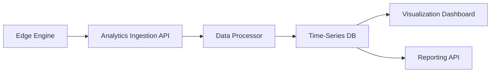

# Comprehensive Architectural Analysis: Universal Redirector System

## Executive Summary

This analysis examines the current state of the Universal Redirector System, a distributed URL redirection platform consisting of an Admin Service and Redirector Engine components. The system demonstrates solid architectural foundations with several strengths but also reveals critical gaps that need attention.

## System Overview

The architecture follows a distributed pattern with:
- **Admin Service**: Centralized control plane using Supabase + Nuxt 3
- **Redirector Engine**: Edge-optimized redirection nodes with multiple runtime support
- **Analytics Service**: Decoupled analytics collection (partially implemented)

## Strengths

### 1. **Solid Core Architecture** ✅
- **Distributed Design**: Clear separation between Admin Service and Edge Nodes
- **Performance-Optimized**: Cuckoo Filter + Radix Tree combination for fast routing
- **Multi-Runtime Support**: Cloudflare Workers, Node.js, and potential for other runtimes
- **Real-time Synchronization**: SSE-based state synchronization from Admin to Edge nodes

### 2. **Advanced Feature Implementation** ✅
- **Targeting Logic**: Language, device, and geo-based routing fully implemented
- **A/B Testing**: Probabilistic split testing with weight distribution
- **Security Features**: Password protection and HSTS enforcement
- **Expiration Logic**: Time-based and click-based expiration with eventual consistency
- **Privacy Compliance**: IP anonymization using SHA-256 hashing

### 3. **Clean Code Structure** ✅
- **Domain-Driven Design**: Clear separation of concerns with use cases, entities, and adapters
- **Type Safety**: Strong TypeScript interfaces throughout the codebase
- **Test Coverage**: Comprehensive E2E test suite covering all major features
- **Modular Design**: Well-organized packages and clear dependency boundaries

### 4. **Modern Technology Stack** ✅
- **Supabase Integration**: Efficient use of PostgreSQL with RLS policies
- **Nuxt 3**: Modern full-stack framework with Nitro server engine
- **Cloudflare Workers**: Edge-optimized runtime for global distribution
- **Real-time Events**: Supabase Realtime for instant state propagation

### 5. **Performance Optimization** ✅
- **Cuckoo Filter**: O(1) complexity for 404 rejection
- **Radix Tree**: Efficient path-based routing
- **Async Analytics**: Non-blocking analytics collection
- **Memory Efficiency**: Optimized for constrained environments (128MB Cloudflare Workers)

## Weaknesses and Critical Issues

### 1. **Analytics Service Gap** ❌
**Severity: HIGH**

**Current State**: 
- Analytics collection is implemented in the engine
- Analytics transmission is set up (fire-and-forget)
- **Missing**: Analytics ingestion, processing, storage, and visualization

**Impact**: 
- No way to view or analyze click data
- Marketing teams cannot measure campaign effectiveness
- No ROI tracking for redirect links

**Required Components**:
- Analytics ingestion API endpoint
- Data processing pipeline (IP anonymization, sessionization)
- Time-series database (e.g., TimescaleDB, InfluxDB)
- Visualization dashboard with charts and metrics

### 2. **UI-Backend Feature Parity Gap** ❌
**Severity: MEDIUM-HIGH**

**Current State**: 
- Backend supports all advanced features (targeting, A/B testing, etc.)
- UI exposes these features but lacks proper validation and user experience
- No form validation for complex configurations
- Missing user guidance for advanced features

**Issues**:
- Complex forms without proper validation
- No preview functionality for targeting rules
- Bulk import exists but lacks error handling
- QR code generation is basic without customization options

### 3. **Error Handling and Resilience** ❌
**Severity: MEDIUM**

**Current State**: 
- Basic error handling in some components
- No comprehensive error strategy
- Missing retry mechanisms for critical operations

**Issues**:
- SSE connection failures not handled gracefully
- No fallback when analytics service is unavailable
- Database connection errors not properly managed
- User-facing error messages are generic

### 4. **Configuration Management** ❌
**Severity: MEDIUM**

**Current State**: 
- Configuration scattered across environment variables
- No centralized configuration management
- Runtime-specific configurations hardcoded

**Issues**:
- Environment-specific settings mixed in code
- No configuration validation
- Difficult to manage multiple deployment environments
- Missing feature flags for gradual rollouts

### 5. **Monitoring and Observability** ❌
**Severity: MEDIUM-HIGH**

**Current State**: 
- Basic console logging
- No structured logging
- No metrics collection
- No alerting system

**Missing Components**:
- Structured logging with correlation IDs
- Performance metrics (latency, error rates, throughput)
- Health check endpoints
- Dashboard for system monitoring
- Alerting for critical issues

### 6. **Security Hardening** ❌
**Severity: MEDIUM**

**Current State**: 
- Basic authentication via Supabase
- RLS policies implemented
- IP anonymization for privacy

**Missing**:
- Rate limiting on public endpoints
- Input validation and sanitization
- CORS configuration
- Security headers beyond HSTS
- Audit logging for administrative actions

## Missing Components and Features

### 1. **Complete Analytics Pipeline**

**Required Implementation**:
- Analytics ingestion endpoint (`/api/analytics/v1/collect`)
- Data processing service (sessionization, aggregation)
- Time-series database integration
- Dashboard with charts (CTR, geographic distribution, device breakdown)
- Export functionality (CSV, PDF reports)

### 2. **Enhanced Admin UI**
**Missing Features**:
- Form validation with real-time feedback
- Preview mode for targeting rules
- Advanced QR code customization (colors, logos, error correction)
- Link performance metrics inline
- Bulk operation status tracking
- User management and permissions

### 3. **Operational Tools**
**Missing Components**:
- Health check endpoints
- Configuration management API
- Deployment automation
- Backup and recovery procedures
- Performance monitoring dashboard
- Error tracking integration (Sentry, etc.)

### 4. **Testing Infrastructure**
**Current State**: Good E2E coverage
**Missing**:
- Integration tests for analytics pipeline
- Load testing for performance validation
- Security testing (penetration testing)
- Chaos engineering for resilience testing

## Improvement Recommendations

### Phase 1: Critical Foundation (Immediate - 2 weeks)
1. **Complete Analytics Service**
   - Implement ingestion API
   - Set up time-series database
   - Create basic dashboard with key metrics
   - Add real-time analytics streaming

2. **Enhance Error Handling**
   - Implement retry mechanisms for SSE connections
   - Add graceful degradation when services are unavailable
   - Improve user-facing error messages
   - Add structured logging throughout the system

3. **Security Hardening**
   - Implement rate limiting
   - Add input validation and sanitization
   - Configure proper CORS policies
   - Add security headers (CSP, XSS protection)

### Phase 2: User Experience Enhancement (2-4 weeks)
1. **Admin UI Improvements**
   - Add form validation with real-time feedback
   - Implement preview functionality for targeting rules
   - Enhance QR code generation with customization
   - Add inline performance metrics
   - Improve bulk operation user experience

2. **Monitoring and Observability**
   - Implement structured logging with correlation IDs
   - Add performance metrics collection
   - Create health check endpoints
   - Set up basic monitoring dashboard
   - Configure alerting for critical issues

### Phase 3: Operational Excellence (4-8 weeks)
1. **Configuration Management**
   - Centralize configuration management
   - Add configuration validation
   - Implement environment-specific configurations
   - Add feature flags for gradual rollouts

2. **Performance Optimization**
   - Implement caching strategies
   - Optimize database queries
   - Add CDN integration for static assets
   - Implement connection pooling

3. **Testing and Quality Assurance**
   - Add integration tests for analytics pipeline
   - Implement load testing
   - Add security testing
   - Create chaos engineering practices

## Technical Debt Assessment

### High Priority Technical Debt
1. **Analytics Service Gap**: Complete missing analytics pipeline
2. **Error Handling**: Implement comprehensive error strategy
3. **Security**: Add missing security layers

### Medium Priority Technical Debt
1. **Configuration Management**: Centralize and validate configurations
2. **Monitoring**: Add observability components
3. **Testing**: Expand test coverage beyond E2E

### Low Priority Technical Debt
1. **Code Duplication**: Some type definitions duplicated across modules
2. **Documentation**: API documentation needs improvement
3. **Performance**: Some optimization opportunities in hot paths

## Architecture Quality Metrics

| Aspect | Score (1-10) | Justification |
|--------|-------------|---------------|
| **Scalability** | 8 | Distributed architecture with edge optimization |
| **Performance** | 9 | Cuckoo filter + radix tree provide excellent performance |
| **Reliability** | 6 | Missing error handling and monitoring |
| **Security** | 6 | Basic security implemented, missing hardening |
| **Maintainability** | 8 | Clean code structure with good separation of concerns |
| **Testability** | 7 | Good E2E coverage, missing integration tests |
| **Deployability** | 7 | Multi-runtime support, missing deployment automation |
| **Observability** | 3 | Basic logging, missing comprehensive monitoring |
| **Completeness** | 6 | Core features complete, missing analytics pipeline |

## Conclusion

The Universal Redirector System demonstrates a solid architectural foundation with excellent performance characteristics and advanced feature implementation. However, critical gaps in the analytics pipeline, error handling, and operational tooling prevent it from being production-ready.

The system shows strong technical competence in its core redirection logic and distributed architecture. The main areas requiring immediate attention are:

1. **Analytics Service**: Complete the missing analytics pipeline to provide value to users
2. **Error Handling**: Implement comprehensive error handling and resilience
3. **Security Hardening**: Add missing security layers for production deployment
4. **Monitoring**: Add observability for operational excellence

With these improvements, the system has the potential to become a high-performance, enterprise-grade URL redirection platform. The architectural foundation is sound, and the development team has demonstrated good engineering practices throughout the codebase.

## Next Steps

1. **Immediate**: Prioritize analytics service implementation
2. **Short-term**: Implement error handling and security improvements
3. **Medium-term**: Enhance admin UI and add monitoring capabilities
4. **Long-term**: Focus on operational excellence and performance optimization

This analysis provides a roadmap for transforming the current prototype into a production-ready, enterprise-grade URL redirection platform.
