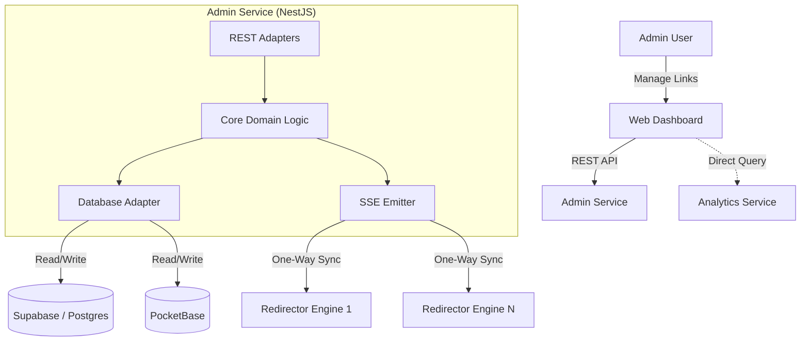

# Admin Service Architecture

## 1. Introduction
The **Admin Service** acts as the central control plane and "Source of Truth" for the Universal Redirector System. It is responsible for managing the lifecycle of redirection rules, handling user authentication, and synchronizing state with distributed Redirector Engines (Edge Nodes).

The service is built using **NestJS** and adheres to **Hexagonal Architecture (Ports & Adapters)** principles to ensure decoupling between business logic, database implementations, and external interfaces.

## 2. Architectural Principles
*   **Hexagonal Architecture:** The core business logic is isolated from external concerns (HTTP, Database, Messaging).
*   **Database Agnostic:** The system is designed to run on either **Supabase (PostgreSQL)** or **PocketBase** without modifying core logic.
*   **Event-Driven Synchronization:** Updates are pushed to Edge Nodes via strictly one-way **Server-Sent Events (SSE)**.
*   **Stateless Authentication:** Authentication is abstracted behind a port, delegating token validation to the underlying backend provider (Supabase/PocketBase).

## 3. System Components (C4 Context)



## 4. Hexagonal Architecture Layers

### 4.1. Domain Layer (Core)
Contains the pure business logic and entities. It depends on nothing but itself.

*   **Entities:**
    *   `Link`: Represents a redirection rule (short code, destination, tags, etc.).
    *   `User`: Represents an administrator or tenant.
    *   `Domain`: Configuration for custom domains.
*   **Services (Use Cases):**
    *   `LinkManagementService`: Validates rules, generates short codes, handles collisions.
    *   `BulkOperationService`: Processes JSON/CSV imports.
    *   `QrCodeService`: Generates QR codes (on-demand).

### 4.2. Ports (Interfaces)
Defines the contracts that the Core layer expects the outer layers to implement.

*   **Driven Ports (Outbound / Infrastructure):**
    *   `RepositoryPort<T>`: Generic interface for CRUD operations.
        *   `LinkRepository`
        *   `UserRepository`
    *   `AuthProviderPort`: Interface for verifying tokens and managing users.
    *   `SyncEmitterPort`: Interface for broadcasting `create`, `update`, `delete` events.

*   **Driving Ports (Inbound / API):**
    *   `LinkServicePort`: Interface defining available operations for the controller.

### 4.3. Adapters Layer
Implementations of the Ports.

*   **Driving Adapters (Primary):**
    *   **REST Controllers:** NestJS Controllers handling HTTP requests, DTO validation, and mapping to Domain calls.
*   **Driven Adapters (Secondary):**
    *   **SupabaseAdapter:** Implements `RepositoryPort` using Supabase JS client.
    *   **PocketBaseAdapter:** Implements `RepositoryPort` using PocketBase SDK.
    *   **SseSyncAdapter:** Implements `SyncEmitterPort` using NestJS `Observable` to stream events to connected Engines.

## 5. Key Flows & Integration

### 5.1. Synchronization (Admin -> Edge)
The synchronization is strictly **one-way**. The Admin Service does not track the health of Edge Nodes.
1.  **Event Trigger:** A link is created/updated in the Core.
2.  **Persistence:** The change is saved to the DB via `RepositoryPort`.
3.  **Broadcast:** The `SyncEmitterPort` emits a structured event:
    ```json
    {
      "type": "LINK_UPDATE",
      "payload": {
        "id": "123",
        "shortCode": "xyz",
        "destination": "https://example.com",
        "status": 301
      }
    }
    ```
4.  **Distribution:** The `SseSyncAdapter` pushes this payload to all active SSE connections.

### 5.2. Authentication
Authentication is abstract. The Admin Service does not own the user table in the traditional sense but mirrors/verifies identity provided by the backend.
1.  **Request:** Client sends `Authorization: Bearer <token>`.
2.  **Guard:** A NestJS Guard calls `AuthProviderPort.verifyToken(token)`.
3.  **Resolution:** The specific adapter (Supabase or PocketBase) validates the JWT against its provider.

### 5.3. Analytics
*   **Out of Scope:** The Admin Service **does not** proxy analytics data.
*   **Implementation:** The Frontend Dashboard queries the Analytics Service directly.

## 6. Directory Structure

The project structure reflects the hexagonal separation of concerns.

```
src/
├── domain/                     # CORE: Pure Business Logic
│   ├── models/                 # Entities (Link, User)
│   ├── ports/                  # Interfaces (Repository, Auth, Sync)
│   └── services/               # Use Case Implementations
│
├── adapters/                   # INFRASTRUCTURE: Implementations
│   ├── inbound/                # Driving Adapters
│   │   └── rest/               # NestJS Controllers, DTOs
│   │
│   └── outbound/               # Driven Adapters
│       ├── persistence/        # Database Implementations
│       │   ├── supabase/
│       │   └── pocketbase/
│       ├── auth/               # Auth Providers
│       │   ├── supabase-auth/
│       │   └── pocketbase-auth/
│       └── sync/               # SSE Implementation
│
├── config/                     # Configuration (Env vars, Dependency Injection)
│
├── shared/                     # Shared utilities, Types
│
└── main.ts                     # Entry point
```

## 7. Technology Stack
*   **Language:** TypeScript
*   **Framework:** NestJS
*   **Documentation:** Swagger / OpenAPI (auto-generated)
*   **Databases:**
    *   PostgreSQL (via Supabase)
    *   SQLite/Go (via PocketBase)
*   **Communication:** HTTP/1.1 (REST), Server-Sent Events (SSE)
