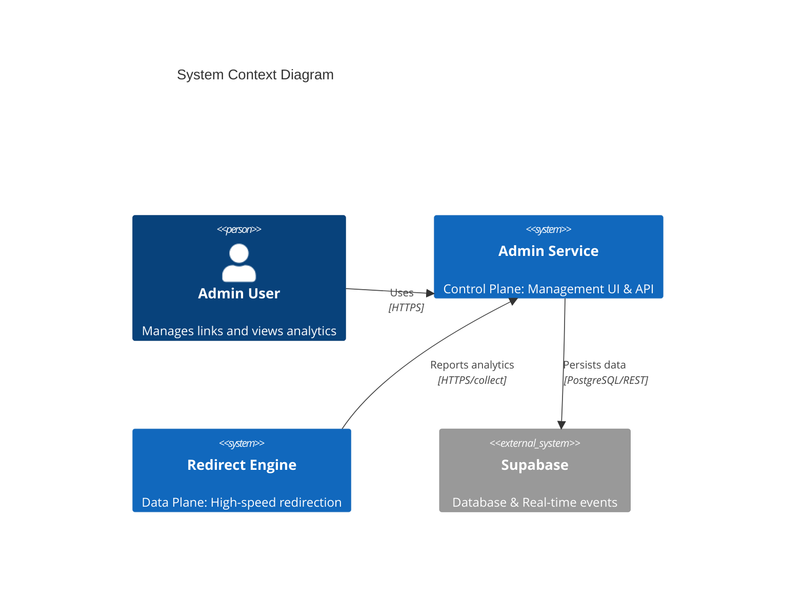

# Architecture Documentation: Universal Redirector System (arc42)

**Version:** 1.0 (Baseline)
**Date:** 2026-04-29
**Status:** Draft

---

## 1. Introduction and Goals

The Universal Redirector System is a high-performance URL redirection platform designed to handle massive volumes of traffic with microsecond latency while providing a rich administration interface for link management and analytics.

### 1.1 Requirements Overview
- **Low Latency**: Redirection should happen in microseconds at the edge.
- **Real-time Updates**: Changes in the Admin Service must be reflected in the Engines almost instantly.
- **Scalability**: Support multiple engine instances across different runtimes (Node.js, Cloudflare Workers).
- **Manageability**: Centralized dashboard for link CRUD, analytics, and system monitoring.

### 1.2 Quality Goals
| Priority | Quality Goal | Description |
|----------|--------------|-------------|
| 1 | Performance | Ultra-fast routing and 404 rejection. |
| 2 | Availability | Decoupled data plane ensures engines work even if Admin is down (assuming state is cached). |
| 3 | Portability | Run on VPS (Node.js) or Edge (Cloudflare Workers). |

### 1.3 Stakeholders
| Role | Expectation |
|------|-------------|
| Admin User | Reliable link management and accurate analytics. |
| End User | Instant redirection without noticeable delay. |
| DevOps/SRE | Easy deployment across different infrastructure providers. |

---

## 2. Architecture Constraints
- **Language**: TypeScript for end-to-end type safety.
- **Frameworks**: Hono (Engine), Nuxt 4 (Admin).
- **Database**: Supabase (PostgreSQL) as the system of record.
- **Infrastructure**: Must support both traditional VPS and serverless Edge environments.

---

## 3. System Scope and Context

### 3.1 Business Context
The system sits between the End User and their Destination URL. It collects analytics on the way.

---

## 4. Solution Strategy
- **Clean Architecture**: Isolate core routing logic from runtime-specific code (Node/CF).
- **Data Structures**: Use Radix Tree for routing and Cuckoo Filter for fast 404 rejection.
- **SSE Sync**: Unidirectional push from Admin to Engine for real-time state updates.
- **Fire-and-Forget Analytics**: Asynchronous reporting to avoid blocking the redirect path.

---

## 5. Building Block View

### 5.1 Whitebox Overall System
The system is split into the **Admin Service** (Control Plane) and the **Redirect Engine** (Data Plane).

#### 5.1.1 Admin Service
- **Nuxt 4 / Vue 3**: Frontend and API routes.
- **Supabase Plugin**: Manages DB connection and real-time triggers.
- **Broadcaster**: Handles SSE stream for engine synchronization.

#### 5.1.2 Redirect Engine
- **Core**: Pure logic for Radix Tree, Cuckoo Filter, and LRU Cache.
- **Use Cases**: Orchestrates request handling and state synchronization.
- **Adapters**: Concrete implementations for HTTP (Hono), SSE (EventSource), and Analytics Reporting.

---

## 6. Runtime View

### 6.1 Redirect Request Flow
1. User hits `/path`.
2. Engine checks Cuckoo Filter. If missing, 404 immediately.
3. Engine checks LRU Cache. If hit, return destination.
4. Engine checks Radix Tree. If hit, update cache and return destination.
5. Engine fires analytics payload asynchronously.

### 6.2 State Sync Flow
1. Admin saves link to DB.
2. DB trigger sends event to Admin API.
3. Admin API broadcasts event via SSE stream.
4. Engine receives event and updates in-memory structures.

---

## 7. Deployment View

### 7.1 VPS Deployment (Node.js)
- Persistent process running the Node runtime.
- Maintains a long-lived SSE connection.
- In-memory state persists across requests.

### 7.2 Edge Deployment (Cloudflare Workers)
- Ephemeral execution.
- State is lost on worker eviction (current limitation).
- Requires KV or persistent storage for production-ready consistency.

---

## 8. Cross-cutting Concepts
- **Type Safety**: Shared types between Admin and Engine.
- **Error Handling**: Graceful degradation (e.g., if analytics collection fails, redirection still works).
- **Logging/Monitoring**: Structured logs for engine performance and admin audits.

---

## 9. Architecture Decisions
Refer to ADRs for detailed rationale:
- [ADR-001: SSE for State Synchronization](adrs/001-sse-state-sync.md)
- [ADR-002: Clean Architecture for Multi-Runtime Support](adrs/002-clean-architecture.md)
- [ADR-003: Cuckoo Filter for 404 Rejection](adrs/003-cuckoo-filter.md)

---

## 10. Quality Requirements
- **L1**: Redirect latency < 10ms (p99) on VPS.
- **L2**: State sync propagation < 500ms.
- **L3**: 404 rejection latency < 1ms.

---

## 11. Risks and Technical Debt
- **No Initial Full Sync**: Engines currently miss state created before they connect.
- **No Domain Awareness**: Multi-tenant/multi-domain routing is not yet implemented.
- **CF Workers Persistence**: Lack of persistent SSE/in-memory state in serverless runtimes.

---

## 12. Glossary
| Term | Definition |
|------|------------|
| Radix Tree | A trie-based data structure for efficient path matching. |
| Cuckoo Filter | A probabilistic data structure for set membership testing (supports deletion). |
| SSE | Server-Sent Events, a standard for real-time server-to-client push. |
| Hono | A small, fast web framework for various runtimes. |
