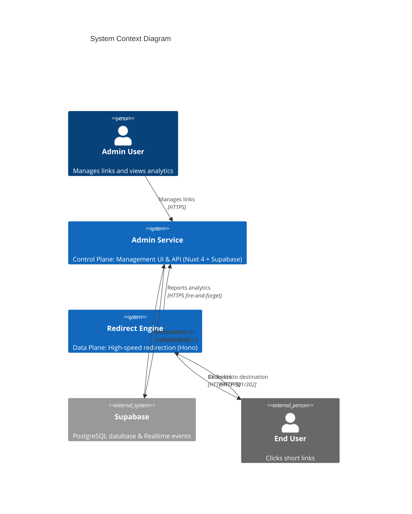
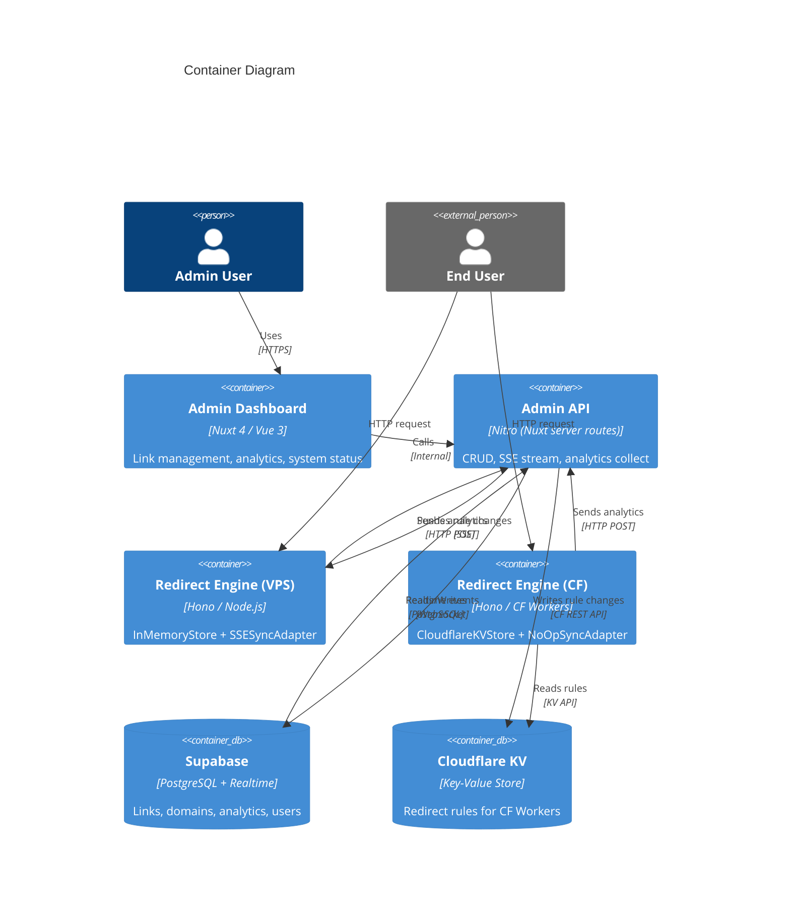

# Architecture Documentation: Universal Redirector System (arc42)

**Version:** 1.1
**Date:** 2026-04-29
**Status:** Current

> **Navigation**
> - [Section 5a: Admin Service Detail](#511-admin-service)
> - [Section 5b: Redirect Engine Detail](#512-redirect-engine)
> - [ADRs](../adrs/) · [LikeC4 Diagrams Source](../likec4/) · [Exported Diagrams](../diagrams/)

---

## 1. Introduction and Goals

The Universal Redirector System is a high-performance URL redirection platform handling massive traffic volumes with microsecond latency, backed by a rich administration interface for link management and analytics.

### 1.1 Requirements Overview
- **Low Latency**: Redirection should happen in < 10ms (p99) at the edge.
- **Real-time Updates**: Changes in the Admin Service must be reflected in Engines within < 500ms.
- **Multi-Runtime**: Support Node.js (VPS) and Cloudflare Workers (Edge) from the same codebase.
- **Manageability**: Centralized dashboard for link CRUD, analytics, and system monitoring.

### 1.2 Quality Goals
| Priority | Quality Goal | Scenario |
|----------|--------------|---------|
| 1 | Performance | 404 rejection < 1ms; redirect < 10ms (p99) on VPS |
| 2 | Portability | Engine runs unmodified on Node.js and Cloudflare Workers by swapping adapters |
| 3 | Availability | Engine serves traffic even when Admin Service is unreachable (state cached in-memory or KV) |
| 4 | Maintainability | Clean Architecture enforced — zero framework imports in core domain logic |

### 1.3 Stakeholders
| Role | Expectation |
|------|-------------|
| Admin User | Reliable link management, accurate analytics, fast UI |
| End User | Instant redirection, no noticeable delay |
| DevOps/SRE | Single codebase deployable to VPS or CF Workers; observable via Prometheus/Grafana |

---

## 2. Architecture Constraints
- **Language**: TypeScript strict mode, end-to-end.
- **Frameworks**: Hono (Engine), Nuxt 4 + Vue 3 (Admin).
- **Database**: Supabase (PostgreSQL) as the system of record; Row Level Security enforced.
- **Infrastructure**: Must support both traditional VPS/Docker and serverless Cloudflare Workers.
- **No Shared Runtime Dependencies**: Engine core must have zero I/O dependencies (testable without network).

---

## 3. System Scope and Context

### 3.1 Business Context



### 3.2 Technical Context

| Interface | Technology | Direction |
|-----------|-----------|-----------|
| Admin UI ↔ API | Nuxt server routes (REST) | Bidirectional |
| Admin ↔ Supabase | Supabase JS client (PostgreSQL) | Bidirectional |
| Supabase → Admin | Supabase Realtime (WebSocket) | Push |
| Admin → Engine | Server-Sent Events (SSE) | Push |
| Engine → Admin | HTTP POST (analytics collect) | Fire-and-forget |
| Admin → CF KV | Cloudflare REST API | Push on mutation |

---

## 4. Solution Strategy

| Decision | Approach | Rationale |
|----------|---------|-----------|
| Architecture style | Hexagonal (Ports & Adapters) | Enables Node.js and CF Workers runtimes without duplicating logic |
| State synchronization | SSE (Node) / CF KV (Edge) | SSE for persistent connections; KV for ephemeral Worker environments |
| 404 fast-path | Cuckoo Filter | O(1) rejection, supports deletions (unlike Bloom filters) |
| Routing | Radix Tree | Memory-efficient, O(k) lookup for path segments |
| Analytics | Fire-and-forget HTTP POST | Never blocks the redirect hot path |
| Security | Supabase RLS + API key auth | Row-level security for multi-tenant data isolation |

---

## 5. Building Block View

### 5.1 Whitebox Overall System



#### 5.1.1 Admin Service

Built with **Nuxt 4 + Vue 3 + Supabase** following a hybrid BFF pattern:

| Component | Location | Responsibility |
|-----------|----------|----------------|
| Vue pages | `app/pages/` | Dashboard UI: link management, analytics charts, status |
| Nuxt server routes | `server/api/` | REST CRUD for links, analytics RPCs, QR generation, sync stream |
| Realtime plugin | `server/plugins/realtime.ts` | Subscribes to Supabase Realtime; broadcasts to SSE clients |
| Broadcaster | `server/utils/broadcaster.ts` | In-process EventEmitter fanning out to SSE connections |
| Transformer | `server/utils/transformer.ts` | DB snake_case → Engine camelCase conversion |
| CF KV Publisher | `server/utils/cloudflare-kv.ts` | Pushes rule changes to CF KV when CF Workers are deployed |

#### 5.1.2 Redirect Engine

Built with **Hono + TypeScript** following **Clean Architecture** (Hexagonal):

```
redir-engine/src/
├── core/            # Domain: RadixTree, CuckooFilter, types — zero I/O deps
├── use-cases/       # Application: HandleRequestUseCase, SyncStateUseCase
├── ports/           # Interfaces: IRedirectStore, ISyncManager
└── adapters/
    ├── store/       # InMemoryStore (Node)
    ├── storage/     # CloudflareKVStore (CF Workers)
    ├── sync/        # SSESyncAdapter (Node), NoOpSyncAdapter (CF Workers)
    ├── http/        # Hono HTTP handler
    ├── analytics/   # FireAndForgetCollector
    ├── cache/       # CacheEvictionManager
    └── metrics/     # Prometheus metrics

redir-engine/runtimes/
├── node/            # Entry: InMemoryStore + SSESyncAdapter
└── cf-worker/       # Entry: CloudflareKVStore + NoOpSyncAdapter
```

---

## 6. Runtime View

### 6.1 Redirect Request Flow (Node.js engine)

```
User → GET /promo
  → CuckooFilter.has('/promo') → false → 404 (O(1), <1ms)
  → CuckooFilter.has('/promo') → true
  → IRedirectStore.getRedirect('/promo') → RedirectRule
  → Apply targeting / A-B / password logic
  → HTTP 301/302 to destination
  → [async] Analytics payload → POST /api/collect
```

### 6.2 State Sync Flow (Node.js engine)

```
Admin UI saves link
  → Supabase INSERT/UPDATE/DELETE
  → Supabase Realtime event → Nitro realtime plugin
  → Broadcaster.emit('db-change', { event, data })
  → SSE stream → SSESyncAdapter.onUpdate callback
  → IRedirectStore.addRedirect(rule) or removeRedirect(path)
```

### 6.3 State Sync Flow (CF Workers engine)

```
Admin UI saves link
  → Nitro API handler → publishRuleToKV(rule) [fire-and-forget]
  → Cloudflare KV REST API PUT/DELETE
  → Next Worker request → CloudflareKVStore.getRedirect(slug)
  → KV.get(key) → RedirectRule → 301/302
```

### 6.4 Advanced Routing Pipeline

A/B Testing, Geo/Language/Device Targeting, Password Protection, and HSTS are applied in sequence **after** a successful store lookup, in the `HandleRequestUseCase`.

- **A/B**: Random number against cumulative variation weights.
- **Targeting**: First-match wins across targeting rules; fallback to base destination.
- **Password Gate**: Serve HTML form; verify POST body password against stored hash.
- **HSTS**: Inject `Strict-Transport-Security` header if domain config enables it.

---

## 7. Deployment View

### 7.1 VPS (Node.js)

| Component | Deployment |
|-----------|-----------|
| Admin Service | Docker container, persistent process |
| Redirect Engine | Docker container, persistent process |
| Database | Supabase (cloud) or self-hosted PostgreSQL |
| Sync | SSE persistent connection |

### 7.2 Edge (Cloudflare Workers)

| Component | Deployment |
|-----------|-----------|
| Admin Service | VPS only (long-running SSE broadcaster) |
| Redirect Engine | CF Worker per domain |
| State storage | Cloudflare KV namespace |
| Sync | CF KV push from Admin on every mutation |

### 7.3 Deployment Matrix

| Component | CF Workers | VPS / Docker |
|-----------|-----------|--------------|
| Redirect Engine | ✅ CloudflareKVStore + NoOpSync | ✅ InMemoryStore + SSESync |
| Admin Service | ❌ Not suitable (long-running) | ✅ Recommended |
| Analytics | CF POST to Admin | Node POST to Admin |

---

## 8. Cross-cutting Concepts

| Concept | Approach |
|---------|---------|
| Type Safety | TypeScript strict mode; shared `RedirectRule` type in `core/config/types.ts` |
| Error Handling | Graceful degradation — analytics failure never affects redirect latency |
| Logging | Structured JSON via Pino (Admin); console.log (Engine, lightweight) |
| Observability | Prometheus metrics exposed at `/metrics` on Engine |
| Security | Supabase RLS; API key on SSE stream (`?apiKey=`); CF API token for KV |
| Privacy | Configurable IP hashing (SHA-256) before analytics transmission |
| Testability | Core domain is pure functions; adapters are injected via ports |

---

## 9. Architecture Decisions

| # | Decision | ADR |
|---|----------|-----|
| 001 | SSE for state synchronization | [ADR-001](../adrs/001-sse-state-sync.md) |
| 002 | Clean / Hexagonal Architecture for multi-runtime | [ADR-002](../adrs/002-clean-architecture.md) |
| 003 | Cuckoo Filter for 404 rejection | [ADR-003](../adrs/003-cuckoo-filter.md) |
| 004 | CF KV for edge Worker state | [ADR-004](../adrs/004-cf-kv-edge-state.md) |

---

## 10. Quality Requirements

### Quality Tree

| Quality | Scenario | Target |
|---------|---------|--------|
| Performance | Redirect (p99) | < 10ms on VPS |
| Performance | 404 rejection | < 1ms |
| Reliability | State sync propagation | < 500ms |
| Portability | Add new runtime | Only new `runtimes/` entry needed |
| Testability | Core logic test coverage | 100% without I/O mocks |

---

## 11. Risks and Technical Debt

| Risk | Impact | Mitigation |
|------|--------|-----------|
| No initial full sync on Engine connect | Engine starts empty, misses pre-existing rules | Planned: snapshot endpoint on connect |
| No domain awareness in routing | Multi-domain links collide in RadixTree | Planned: CHANGE-015 follow-up |
| CF Worker eviction loses in-memory state | Rare for KV-backed workers | KV is persistent; no in-memory state in CF runtime |
| CF KV fire-and-forget publish can fail silently | Rule in DB but not in KV | Planned: retry queue / reconciliation job |

---

## 12. Glossary

| Term | Definition |
|------|------------|
| Radix Tree | A trie-based data structure for efficient path segment matching |
| Cuckoo Filter | A probabilistic set membership structure supporting deletion |
| SSE | Server-Sent Events — HTTP/1.1 standard for server-to-client push |
| Hono | Ultrafast web framework supporting Node, CF Workers, Bun, Deno |
| KV | Cloudflare Workers KV — a globally distributed key-value store |
| RLS | Row Level Security — PostgreSQL feature for per-row access control |
| ADR | Architecture Decision Record — documents a significant design choice |
| IRedirectStore | Port (interface) abstracting redirect lookup and mutation |
| ISyncManager | Port (interface) abstracting state synchronization lifecycle |
