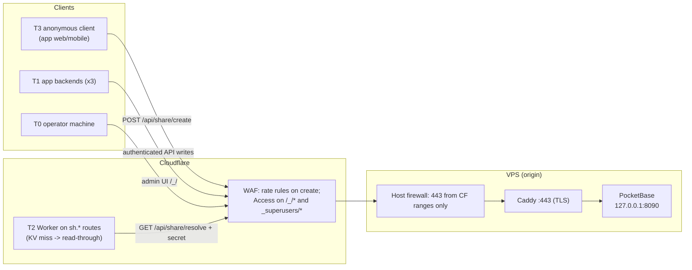

# Security Profile: `pocketbase-vps-cf`

> **Status:** Active — the deployment profile required by `public-share-shortener` (ADR-007, tasks §1–§6).
> **Implements:** [`security-model.md`](security-model.md) (variant-invariant trust model, ADR-008).
> **Stack:** PocketBase (single binary, SQLite) on a VPS, behind Caddy and the Cloudflare proxy (orange cloud). One Cloudflare Worker is the edge runtime.

---

## 1. Ingress Topology



- The public hostname (`pb.<domain>`) is proxied (orange cloud). **SSL/TLS mode: Full (strict)** — never Flexible.
- The origin accepts 443 **only from Cloudflare IP ranges**, so origin-IP discovery (bypassing WAF/Access) gains nothing.
- PocketBase binds to localhost; Caddy is the only process that talks to it.
- A `cloudflared` **tunnel is a compliant alternative** to the "firewall to CF ranges" setup and preferred long-term (zero inbound ports; the migration plan already uses cloudflared for preview). Everything below applies identically except §2.1's firewall rules.

Degradation behavior (per ADR-007): PocketBase down ⇒ creates and read-through fail, existing links keep redirecting from KV; Cloudflare down ⇒ everything behind it fails (accepted).

## 2. Host Layer (L0)

### 2.1 PocketBase process

```bash
./pocketbase serve --http=127.0.0.1:8090
```

**Prerequisite:** run the latest stable PocketBase — the profile assumes superusers living in the `_superusers` collection and MFA support (verify against the release notes of the version you deploy; the repo's `POCKETBASE_SETUP.md` examples reference 0.22.x and must not be treated as the target version). Upgrading is part of task §1 foundation work.

### 2.2 Host firewall — 443 from Cloudflare only

```bash
ufw default deny incoming
ufw default allow outgoing
# SSH: tailnet/key-only, never public
ufw allow in on tailscale0 to any port 22
# 443: Cloudflare ranges only (https://www.cloudflare.com/ips/)
for ip in $(curl -s https://www.cloudflare.com/ips-v4); do ufw allow from "$ip" to any port 443 proto tcp; done
for ip in $(curl -s https://www.cloudflare.com/ips-v6); do ufw allow from "$ip" to any port 443 proto tcp; done
ufw enable
```

Re-run the range refresh on a monthly cron (Cloudflare occasionally adds ranges). With a `cloudflared` tunnel instead, no 443 rule is needed at all — the tunnel is an outbound connection.

### 2.3 SSH

Key-only auth, password login disabled, root login disabled; SSH reachable via tailnet or a restricted IP set only.

## 3. Edge Layer (L1) — Cloudflare + Caddy

### 3.1 Cloudflare Access on the admin surface (T0 only, identity-based)

Create Zero Trust **Access → Self-hosted** applications (free tier suffices) for:

- `pb.<domain>/_/*` — the PocketBase dashboard
- `pb.<domain>/api/collections/_superusers/*` — superuser authentication endpoints

Policy: only the operator's identity (email OTP / GitHub / etc.). Identity-based access survives operator IP changes, which IP allowlists do not. **Fallback** if Access is unsuitable: a WAF custom rule —
`(starts_with(http.request.uri.path, "/_/") or starts_with(http.request.uri.path, "/api/collections/_superusers")) and not ip.src in {OPERATOR_IP}` → *Block*.

Blocking `_superusers/*` at the edge removes the entire superuser password brute-force surface from the public internet.

### 3.2 WAF rate rule on the create endpoint (task 4.3)

Rate rule keyed on `CF-Connecting-IP` for `POST /api/share/create` (e.g. 10/min burst) — the blunt outer layer ahead of PocketBase's per-IP daily quota.

### 3.3 Resolve path (T2 only, recommended)

Put the resolve endpoint behind an **Access service token** (`CF-Access-Client-Id`/`CF-Access-Client-Secret` headers from the Worker) so only the Worker can reach it. Belt-and-braces: the endpoint itself additionally checks a Bearer secret (§5.2). If the service-token option is skipped, the Bearer check is mandatory.

### 3.4 Caddy — origin-side belt and braces

```caddyfile
pb.<domain> {
	# Admin surface: only tailnet or the operator's static IP gets past the origin,
	# even if the CF configuration is ever lost or bypassed.
	@admin {
		path /_/* /api/collections/_superusers/*
		not remote_ip 100.64.0.0/10 203.0.113.10
	}
	respond @admin 403

	reverse_proxy 127.0.0.1:8090
}
```

Caddy forwards incoming headers (including `CF-Connecting-IP`) by default — do not strip them; PocketBase hooks key quotas on that header (ADR-007 Decision 5).

## 4. Data Layer (L2) — Identities and Collection Rules

### 4.1 Superuser hygiene (T0)

- One superuser account, unique strong password, **MFA enabled** (task 4.4).
- The superuser token is never embedded in any backend, Worker, script, or client. A leaked superuser token can change the rules themselves — it is game over by definition.

### 4.2 Service identities (T1)

Create a `services` **auth collection** for the app backends:

- Fields: `name`, `role` (default `"backend"`), optional `app` relation.
- One record per backend — never a shared record.
- Long token duration, or superuser-minted long-lived impersonate tokens, so no backend stores a password long-term.

Backends authenticate and receive exactly what the rules below grant. Nothing wider exists for them to lose.

### 4.3 Collection rules — lock by default

"**Lock**" = rule set to *null* (superuser-only in the PocketBase dashboard). This is the C1 fix under the pivot schema: the previous `@request.auth.id != ""` rule family (any-authenticated full CRUD) is replaced by locked-by-default, with access granted only through the purpose-built routes in §5. Server-side code (hooks, custom routes, cron) bypasses collection rules, so locking does not break the create/resolve paths.

| Collection | list | view | create | update | delete | Notes |
|---|---|---|---|---|---|---|
| `apps` (registry) | Lock | Lock | Lock | Lock | Lock | Registry edits are an operator action (T0) |
| `links` | Lock | Lock | Lock \* | Lock | Lock | \* only if backend-created links are enabled: `@request.auth.role = "backend"`; otherwise lock — all creates go through the anonymous endpoint |
| `system_config` (breaker flag) | Lock | Lock | Lock | Lock | Lock | Read/written server-side only |
| `services` (auth) | Lock | `id = @request.auth.id` | Lock | Lock | Lock | Operator creates service records; a service sees only itself |
| `_superusers` | — system — | | | | | Protected by PocketBase itself + §3.1 edge rules |

Anything else the schema grows later starts **locked** and earns grants through profile updates, never the other way around.

### 4.4 Login cookie (H16)

`httpOnly: true` on the auth cookie in `server/api/auth/login.post.ts` (task 1.2) — an XSS in the Nuxt layer must not be able to lift a session.

### 4.5 Rate limits

Dashboard → settings → rate limits: tighten the `auth` preset (login/token minting) well below defaults; keep `create` aligned with the WAF burst rule. The per-IP daily quota (task 2.4) is separate and lives in the create hook.

## 5. Application Layer (L3) — Public Endpoints

### 5.1 `POST /api/share/create` (T3)

The single public write path, implementing the full abuse stack per ADR-007 Decision 5: Turnstile verification in the before-create hook (task 2.3), per-IP daily quota keyed on `CF-Connecting-IP` (task 2.4), circuit breaker (task 2.5), first-party destination allowlist renderer/validator (task 2.2), random unguessable slugs (task 2.6), CORS restricted to the three app origins and failing closed (task 2.1).

### 5.2 `GET /api/share/resolve?host=&path=` (T2)

The Worker's read-through fallback (task 2.8), hardened per this profile:

- **GET-only**, exact-key lookup (`host` + `path`), returns the minimum (`destination`, status); no listing, no filtering, no enumeration surface (random slugs + rate limit carry anti-enumeration).
- **Bearer secret required** (`Authorization: Bearer $WORKER_RESOLVE_SECRET`, stored as a PocketBase env setting, set as a Worker secret) — even though KV contents are de-facto public-read (anyone can click a link), auth keeps the data plane closed to programmatic readers other than the Worker.
- Rate-limited (endpoint-local limiter + optional §3.3 edge rule).

T2's "no writes, structurally" invariant is satisfied by construction: this route has no write semantics, and no other data-plane route is reachable for the Worker.

## 6. Secrets Inventory

| Secret | Held by | Purpose | Rotation |
|---|---|---|---|
| Superuser password + MFA | Operator (T0) only | Admin surface | On suspicion; MFA device enrolled once |
| `services` credentials / impersonate tokens | One per app backend (T1) | Data-plane writes per §4.3 | Long-lived; rotate on off-boarding or suspicion |
| `WORKER_RESOLVE_SECRET` | PocketBase env + Worker secret (T2) | Resolve endpoint auth | On demand (two-line change: PB setting + Worker secret) |
| Turnstile secret key | PocketBase settings | Create-endpoint bot gate | Rare (Cloudflare-managed) |
| `IP_HASH_SALT` | PocketBase env | HMAC key for hashed create IPs (quota keying 2.4, create analytics 3.6); never raw IPs | Rare; rotating resets per-IP quota buckets |
| Cloudflare KV API token | PocketBase settings | KV publisher hook (task 2.7) | Rare; scope to the one namespace |
| CF Access service token (if §3.3) | Worker secret + Access policy | Resolve path edge auth | On demand |

No app client (T3) ever holds a secret — Turnstile tokens are the only client-supplied credential material (ADR-007 constraint).

## 7. Operations (L4)

- **Backups:** built-in ZIP backup on a daily cron (`pocketbase createbackup`) with an off-box copy; restore steps documented and drilled (task 4.4).
- **Updates:** monthly cadence — refresh CF IP ranges (§2.2), `pocketbase update` (runs migrations), Caddy/OS patches; watch PocketBase releases for security fixes between cycles.
- **Dashboard security checklist** green before public exposure.
- **Runbook** covers takedown, breaker trip/reset, app #4 onboarding, PB-down behavior (task 4.6).

## 8. Verification Drills (extend tasks §6)

Negative tests — each "must never" cell must be proven to fail closed:

| Drill | Expected |
|---|---|
| Browse `pb.<domain>/_/` from a non-operator network | CF Access login (or 403) — never the dashboard |
| `POST /api/collections/_superusers/auth-with-password` from a non-operator network | Blocked at edge |
| Hit the origin IP directly on :443 / :8090 | Timeout/refused (firewall + localhost bind) |
| `GET /api/share/resolve` without secret / wrong secret | 401 |
| Anonymous `GET /api/collections/links/records` (list) | 403/404 — rules locked |
| Authenticated `services` record attempts `PATCH /api/collections/apps/...` | 403 — registry is T0-only |
| Flood drills (tasks 6.2) | 403/429/503 paths; clicks unaffected while tripped |

Positive paths: operator login works from the operator network; Worker read-through populates KV and redirects (task 6.3); create flow unaffected while breaker untripped.

## 9. Task Mapping

| Profile section | `public-share-shortener` tasks |
|---|---|
| §2 Host layer | 1.6 (idempotent migrations), foundation |
| §3.2 Edge rate rule | 4.3 |
| §4.1 Superuser MFA | 4.4 |
| §4.3 Locked rules (C1) | 1.1, 1.7 |
| §4.4 httpOnly (H16) | 1.2 |
| §5.1 Create endpoint | 2.1–2.6, 2.9, 2.10 |
| §5.2 Resolve endpoint | 2.8, 3.5 |
| §7 Ops | 4.1, 4.2, 4.4, 4.6 |
| §8 Drills | 6.1–6.4 |
