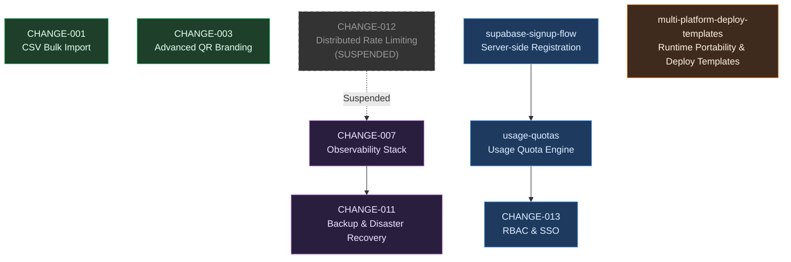

# OpenSpec — Implementation Roadmap

> Changes still to be implemented (archived ones excluded).

## Legend

| Colour | Group | Rationale |
|--------|-------|-----------|
| 🔵 Blue | **Beta Readiness** | Must ship before / during public beta: signup gate → quota enforcement → RBAC |
| 🟣 Purple | **Infrastructure** | Ops hardening: distributed rate limiting feeds observability; observability gates backup strategy |
| 🟢 Green | **Feature Expansion** | Value-add features with no hard upstream deps (CSV bulk import, QR branding) |
| 🟠 Orange | **Standalone** | Multi-platform deploy templates — infrastructure-adjacent but fully independent |

## Dependency Notes

### Beta Readiness chain (strict precedence)
1. **`supabase-signup-flow`** — prerequisite for everything else in this chain; adds the server-side registration endpoint that quota and RBAC hooks attach to.
2. **`usage-quotas`** — depends on `supabase-signup-flow` (Supabase stack) to wire quota checks at registration; can proceed in parallel for the PocketBase stack.
3. **`CHANGE-013` (RBAC & SSO)** — logically follows quotas; once per-user limits exist, role-based permission boundaries are the next layer of access control.

### Infrastructure chain (loose precedence)
1. **`CHANGE-012`** (Distributed Rate Limiting) — **[SUSPENDED]** Replaces in-memory limiters with Redis. Priority has shifted to admin usage limits.
2. **`CHANGE-007`** (Observability Stack) — Best implemented after distributed rate limiting is in place (or if decided otherwise) so dashboards capture cross-instance metrics.
3. **`CHANGE-011`** (Backup & DR) — depends on a stable, observable system; the backup health alerting plugs into the monitoring stack from CHANGE-007.

### Independent changes
- **`CHANGE-001`** (CSV Bulk Import) — admin UI feature, no upstream deps.
- **`CHANGE-003`** (Advanced QR Branding) — UI/storage feature, no upstream deps.
- **`multi-platform-deploy-templates`** — engine portability docs and new runtimes; touches no shared state with any other change.
