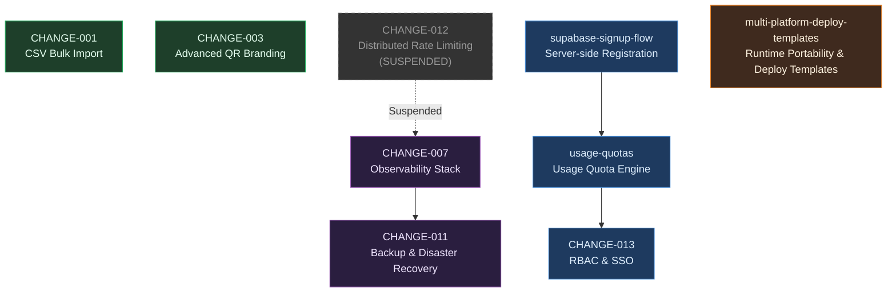

# OpenSpec — Implementation Roadmap

> Changes still to be implemented (archived ones excluded).

```mermaid
flowchart TD
    %% ── Nodes ──────────────────────────────────────────────────────────
    C001["CHANGE-001\nCSV Bulk Import"]
    C003["CHANGE-003\nAdvanced QR Branding"]
    C007["CHANGE-007\nObservability Stack"]
    C011["CHANGE-011\nBackup & Disaster Recovery"]
    C012["CHANGE-012\nDistributed Rate Limiting\n(SUSPENDED)"]
    C013["CHANGE-013\nRBAC & SSO"]
    SSF["supabase-signup-flow\nServer-side Registration"]
    UQ["usage-quotas\nUsage Quota Engine"]
    MPD["multi-platform-deploy-templates\nRuntime Portability & Deploy Templates"]

    %% ── Dependencies ───────────────────────────────────────────────────
    SSF --> UQ
    UQ  --> C013

    C007 --> C011
    C012 -.->|Suspended| C007

    %% ── Styling ────────────────────────────────────────────────────────
    classDef betaReady   fill:#1e3a5f,stroke:#4a90d9,color:#e0f0ff
    classDef infra       fill:#2a1e3f,stroke:#9b59b6,color:#f0e6ff
    classDef feature     fill:#1e3f2a,stroke:#27ae60,color:#e6fff0
    classDef standalone  fill:#3f2a1e,stroke:#e67e22,color:#fff3e0
    classDef suspended   fill:#333333,stroke:#666666,color:#999999,stroke-dasharray: 5 5

    class SSF,UQ,C013 betaReady
    class C007,C011 infra
    class C012 suspended
    class C003,C001 feature
    class MPD standalone
```

## Legend

| Colour | Group | Rationale |
|--------|-------|-----------|
| 🔵 Blue | **Beta Readiness** | Must ship before / during public beta: signup gate → quota enforcement → RBAC |
| 🟣 Purple | **Infrastructure** | Ops hardening: distributed rate limiting feeds observability; observability gates backup strategy |
| 🟢 Green | **Feature Expansion** | Value-add features with no hard upstream deps (CSV bulk import, QR branding) |
| 🟠 Orange | **Standalone** | Multi-platform deploy templates — infrastructure-adjacent but fully independent |

## Dependency Notes

### Beta Readiness chain (strict precedence)
1. **`supabase-signup-flow`** — prerequisite for everything else in this chain; adds the server-side registration endpoint that quota and RBAC hooks attach to.
2. **`usage-quotas`** — depends on `supabase-signup-flow` (Supabase stack) to wire quota checks at registration; can proceed in parallel for the PocketBase stack.
3. **`CHANGE-013` (RBAC & SSO)** — logically follows quotas; once per-user limits exist, role-based permission boundaries are the next layer of access control.

### Infrastructure chain (loose precedence)
1. **`CHANGE-012`** (Distributed Rate Limiting) — **[SUSPENDED]** Replaces in-memory limiters with Redis. Priority has shifted to admin usage limits.
2. **`CHANGE-007`** (Observability Stack) — Best implemented after distributed rate limiting is in place (or if decided otherwise) so dashboards capture cross-instance metrics.
3. **`CHANGE-011`** (Backup & DR) — depends on a stable, observable system; the backup health alerting plugs into the monitoring stack from CHANGE-007.

### Independent changes
- **`CHANGE-001`** (CSV Bulk Import) — admin UI feature, no upstream deps.
- **`CHANGE-003`** (Advanced QR Branding) — UI/storage feature, no upstream deps.
- **`multi-platform-deploy-templates`** — engine portability docs and new runtimes; touches no shared state with any other change.

## Review Log

### 2026-09-29 — Whole-Project Architecture & Roadmap Review
**Reviewer:** Kilo review agent (GLM, Z.ai) — Radical Candor review pass
**Scope:** `roadmap.md`, `constitution.md`, specs 01–06, ADR-001–006, `arc42.md`, all 9 active changes (proposal + tasks), read-only code spot-checks of `redir-engine/src`, `admin-service/{supabase,pocketbase}`, `infra/caddy`, `docker-compose.yml`, `.github/workflows/ci.yml`. Cross-checked against living review `review.md` (2026-06-22) — verified rather than duplicated.
**Verdict:** **NEEDS_REVISION** — 5 blocking, 12 non-blocking findings.

#### Blocking findings

1. `issue (blocking, security):` **PocketBase cross-tenant authorization bypass is still shipped.** All five `links` API rules remain `@request.auth.id != ""` (`admin-service/pocketbase/pb_migrations/1777556624_updated_links.js:7-11`), so any authenticated user can CRUD every tenant's links. Yet ADR-005/arc42 present PocketBase as production-viable ("ideal for small/self-hosted deployments") and no active change fixes this. Fix the rules or formally demote PocketBase to dev-only in ADR-005 and the roadmap.

2. `issue (blocking, security):` **The production edge is still broken and unauthenticated-by-default, and no roadmap change owns the fix.** Caddy proxies to `admin:3001`/`engine:3002` while containers listen on 3000 (`infra/caddy/Caddyfile:6,15,23` vs `docker-compose.yml:59,73,99,108`); `POSTGRES_HOST_AUTH_METHOD: trust` remains (`docker-compose.yml:17`); CORS still fails open when unconfigured, reflects any origin, and sends `Access-Control-Allow-Credentials: true` — with the shipped compose setting `CORS_ALLOWED_ORIGINS: "*"` (`admin-service/supabase/server/middleware/security.ts:56-62`, `docker-compose.yml:64`). TLS (NFR-04) is marked ✅ on the strength of a Caddyfile that cannot reach its upstreams.

3. `issue (blocking):` **The roadmap plans features on a foundation with known critical defects but contains no change that repairs the foundation.** None of the 9 active changes addresses: radix-trie pruning (memory leak — pruning block is still commented pseudo-code, `redir-engine/src/core/routing/radix-tree.ts:52-68`), SSE snapshot/Last-Event-ID catch-up (ADR-001 admits it; `sse-client.ts` has none), CF KV publish durability (fire-and-forget with warn-only logging, `admin-service/supabase/server/utils/cloudflare-kv.ts:38-58`), broken CF Worker deploy (no `[env.*]` in `runtimes/cf-worker/wrangler.toml`, placeholder vars), or deploy scripts pulling images that compose defines only via `build:`. CHANGE-011 plans backups and CHANGE-007 dashboards for a "production" whose TLS edge and deploy path do not currently function. Add a Phase-0 hardening change or fold these into existing changes as explicit gating tasks.

4. `issue (blocking):` **Specs mark requirements ✅ Implemented that cannot work in the implemented sync path.** (a) FR-36/FR-37 click-based expiration: `handle-request.ts:55` compares `rule.clicks >= rule.maxClicks`, but the SSE transformer defines neither `clicks` nor propagates it (`admin-service/supabase/server/utils/transformer.ts:46-44` — `SupabaseLink`/`RedirectRule` have no `clicks` field), so the check never fires on any engine that received the rule via sync; spec 03 records both as ✅. (b) FR-50/51 per-link 301/302: transformer hardcodes `code: 301` ("schema does not support status_code yet", `transformer.ts:74`) while spec 05 claims type-level ✅. Spec status markers are the project's governance signal; falsified ✅ values are worse than missing features.

5. `issue (blocking):` **The rate-limiting story contradicts itself across five artifacts.** CHANGE-012 is SUSPENDED ("not strictly required"), NFR-10 and arc42 §5.1.1/§8 say "in-memory only, Redis-backed planned (CHANGE-012)", ADR-006 "Current State" says in-memory with potential Redis fallback — but `admin-service/supabase/server/utils/rate-limit.ts:26` already calls `useValkey()` (fixed-window + violation backoff, not the sliding window CHANGE-012 specifies, no factory/fallback as designed). Meanwhile PocketBase's limiter is still a plain in-memory Map (`admin-service/pocketbase/server/utils/rate-limit.ts:9`), so "both variants" claims in arc42 are wrong in both directions. On Redis error the Supabase limiter returns `allowed: true` (`rate-limit.ts:68`) — fail-open contradicts constitution §"No endpoint bypasses rate limiting". Reconcile: update ADR-006/NFR-10/arc42 to match reality, and decide the failure policy.

#### Suggestions (non-blocking)

6. `suggestion (non-blocking):` Clean-architecture leak: use-cases import the adapter-layer Prometheus singleton (`handle-request.ts:1`, `sync-state.ts:1,4`) and instantiate `CacheEvictionManager` directly (`sync-state.ts:15`), violating ADR-002/constitution "no adapter imports from business logic". Introduce a metrics/logging port or emit domain events.

7. `suggestion (non-blocking):` Bundle an "SSE protocol hardening" change: (a) `sse-client.ts:56` logs the full sync URL **including the apiKey** — redact; (b) inbound events are `JSON.parse` with no Zod/try-catch (`sse-client.ts:90,95,100`); (c) still no snapshot/`Last-Event-ID` replay (cold-start race: `runtimes/node/index.ts:41-50` starts HTTP serving while sync is connecting). No current change owns this.

8. `suggestion (non-blocking):` `usage-quotas` task 4.3 assumes a Supabase domain-creation endpoint, but none exists (`admin-service/supabase/server/api/domains/**` — no files; ADR-005 lists Domains UI as PocketBase-only). Add the missing dependency to the change scope or descope `max_domains` for Supabase.

9. `suggestion (non-blocking):` `usage-quotas` section 2 is titled "shared" but creates duplicate `quota.ts` in both variants — move it to `admin-service/shared/` per arc42 §2 and ADR-005, or the M1 duplication problem grows by design.

10. `suggestion (non-blocking):` `multi-platform-deploy-templates` proposal self-contradicts: "deferring the implementation of new runtime adapters to a later phase" (proposal line 3) vs adding Bun/Deno runtimes and `SupabaseEdgeKVStore` (lines 9-11, tasks §2-4). Also front-loads new runtimes while the existing CF Worker deploy is broken (C3). Sequence: fix/verify CF deploy first, then add runtimes.

11. `suggestion (non-blocking):` CF runtime vs ADR-003/arc42: `CloudflareKVStore.mightExist()` returns `true` unconditionally (`CloudflareKVStore.ts:28-31`), so the cuckoo fast-404 gate — quality goal #1 "404 rejection < 1ms" — does not exist on the edge runtime. ADR-004 should record this exception. Also `runtimes/cf-worker/index.ts:94-105` rebuilds collector/store/use-case/app per request and never passes `waitUntil` to `FireAndForgetCollector`, so analytics POSTs are dropped at end-of-request on Workers.

12. `suggestion (non-blocking):` NFR-05 "❌ Not Implemented" and CHANGE-007 tasks 1-2 (all unchecked) are stale: engine `/metrics` exists (`adapters/http/server.ts:24`) and admin `/api/metrics` exists (`server/api/metrics.get.ts`). Rescope CHANGE-007 to the actual gap (aggregation, Loki, Alertmanager — tasks 3-4) and check off done items; task-status drift (prior M16) is recurring.

#### Question / Thought / Nitpicks (non-blocking)

13. `question (non-blocking):` `rate-limit.ts:68` — on Redis error the limiter fails open, with the comment "Fail open or closed? Open for resiliency?" left unanswered in production code. Which is the intended policy? Decide, test it, and document it in ADR-006.

14. `thought (non-blocking):` Dual-admin drift is accelerating structurally: rate limiting (Valkey vs in-memory), domains (PB-only), CF KV (Supabase-only) now differ. Every future change (usage-quotas, RBAC/SSO) costs ~2x and re-introduces parity risk. ADR-005 needs a decision: invest in `admin-service/shared/` consolidation or explicitly demote PocketBase to dev-only. Keeping it ambiguous is the most expensive option.

15. `nitpick (non-blocking):` Roadmap mermaid: `C012 -.->|Suspended| C007` plus the note "(or if decided otherwise)" leaves observability sequencing ambiguous — state the chosen order after the suspension decision.

16. `nitpick (non-blocking):` `loadConfig` silently defaults `adminServiceUrl` to `http://localhost:3001/api/sync/stream` (`core/config/index.ts:10`) — a misconfigured production engine silently syncs from localhost. Prefer fail-fast for required URLs (constitution: validate env).

#### Praise

17. `praise:` The engine hot path remains the best thing in this repo: a genuinely clean hexagonal core with narrow ports (`IRedirectStore`, `ISyncManager`), lazy contexts, and a disciplined fire-and-forget analytics boundary. The last three months show real, verifiable quality investment — coverage thresholds configured and repo-wide coverage PRs (`4e9625f`, `17d6df6`, `5fef4b6`, `e3b5c32`), streaming CSV export to fix a memory blow-up (`91a8e03`), and honest bookkeeping (CHANGE-012 marked SUSPENDED in diagram *and* proposal; specs candidly marking FR-27/29/32/34 partial/missing). The roadmap's dependency diagram with an explicit suspension state is exactly how a living planning artifact should behave — this review's complaints are about what's missing from it, not how it's run.
