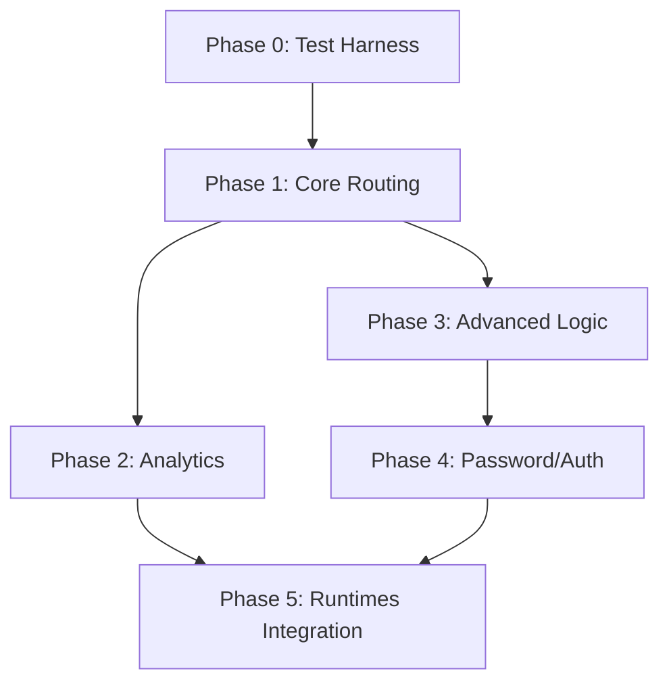

# Redirector Engine Development Plan

This document outlines the step-by-step development plan for the Redirector Engine. The development will strictly follow a **Test Driven Development (TDD)** approach, where a standalone, black-box E2E test suite acts as the executable specification for the engine.

## 1. Architectural Principles

1.  **Runtime Agnostic Core:** The core logic (Routing, Filtering, Analytics Construction) must be decoupled from the HTTP server implementation. This allows the same code to run on **Node.js** (via Hono Node Adapter) and **Cloudflare Workers**.
2.  **Contract-First Testing:** A standalone E2E test suite will define the behavior. Any engine implementation (Node, Go, Rust) that passes this suite is considered compliant.
3.  **Simulation:** External dependencies (Admin Service, Analytics Service) will be mocked within the test harness to ensure deterministic testing.

---

## 2. Proposed Directory Structure

We will adopt a Clean Architecture layout to separate concerns.

```text
redir-engine/
├── src/
│   ├── core/                 # Pure domain logic (No IO/HTTP deps)
│   │   ├── routing/          # Radix Tree logic
│   │   ├── filtering/        # Cuckoo Filter logic
│   │   ├── analytics/        # Payload construction & Hashing
│   │   └── config/           # Configuration types
│   ├── use-cases/            # Application business rules
│   │   ├── handle-request.ts # Main flow: Request -> Router -> Action
│   │   └── sync-state.ts     # Handling SSE updates
│   └── adapters/             # Interface implementations
│       ├── http/             # Hono handlers
│       └── sse/              # SSE Client implementation
├── runtimes/
│   ├── node/                 # Entry point for Node.js
│   └── cf-worker/            # Entry point for Cloudflare Workers
├── e2e-suite/                # STANDALONE Black-box Test Suite
│   ├── mocks/                # Mock Admin & Analytics servers
│   ├── specs/                # Test scenarios
│   └── package.json          # Separate dependencies (Vitest)
└── package.json              # Engine dependencies
```

---

## 3. The Standalone E2E Test Suite (The "Contract")

**Technology:** Vitest
**Location:** `redir-engine/e2e-suite/`

This suite is the **primary deliverable** for the first phase. It runs independently of the engine's internal code. It treats the engine as a black box listening on a port.

### 3.1 Test Harness Components

1.  **Mock Admin Service:**
    *   Starts a local HTTP server.
    *   Exposes `GET /sync/stream`.
    *   Ability to programmatically push SSE events (`create`, `update`, `delete`) during a test.
2.  **Mock Analytics Service:**
    *   Starts a local HTTP server.
    *   Exposes `POST /v1/collect`.
    *   Stores received payloads in memory for assertion.
3.  **Engine Controller:**
    *   A utility to start/stop the Redirector Engine (as a child process or worker) with environment variables pointing to the Mock Admin/Analytics URLs.

### 3.2 Key Test Scenarios (The Checklist)

*   **T01: Boot & Sync:** Engine starts, connects to Mock Admin, and accepts initial state via SSE.
*   **T02: Basic Redirect:** Hit a known route -> Expect 301/302 to destination.
*   **T03: Fast 404:** Hit unknown route -> Expect 404 (Verify internal Cuckoo check if possible, or timing).
*   **T04: Analytics Emission:** Trigger redirect -> Assert Mock Analytics received correct JSON payload.
*   **T05: Priority Logic:** Request with `?ref=x` vs `Referer` header -> Assert Analytics payload has `source_type: 'explicit'`.
*   **T06: A/B Testing:** Hit same URL 100 times -> Assert distribution matches configured weights in Analytics.
*   **T07: Geo/Lang Fallback:** Send `Accept-Language` header -> Expect specific destination.
*   **T08: Privacy:** Enable IP Anonymization -> Trigger redirect -> Assert Analytics received Hashed IP.
*   **T09: Authentication:** Hit password-protected link -> Expect HTML Form -> POST password -> Expect Redirect.
*   **T10: HSTS:** Check headers on response -> Expect `Strict-Transport-Security`.

---

## 4. Development Tasks & Phasing

### Phase 0: Foundation & Harness
*   **Task 0.1:** Initialize repository structure and `package.json` workspaces.
*   **Task 0.2:** Implement the **Mock Admin Service** (SSE Emitter) in `e2e-suite`.
*   **Task 0.3:** Implement the **Mock Analytics Service** (Receiver) in `e2e-suite`.
*   **Task 0.4:** Create the `EngineClient` helper to spawn the engine and wait for readiness.
*   **Task 0.5:** Write the first failing test: `T01: Boot & Sync`.

### Phase 1: Core Routing Loop
*   **Task 1.1:** setup `src/core` with Cuckoo Filter and Radix Tree data structures.
*   **Task 1.2:** Implement the **SSE Client** in `src/adapters/sse` to consume events from Mock Admin and update local state.
*   **Task 1.3:** Create Hono app skeleton in `src/adapters/http` that responds to `GET *`.
*   **Task 1.4:** Wire up the Request Handler: Check Cuckoo -> Check Radix -> Return Redirect.
*   **Verification:** Pass Tests T01, T02, T03.

### Phase 2: Analytics & Attributes
*   **Task 2.1:** Implement `resolveReferrer` logic (Hybrid Priority Strategy).
*   **Task 2.2:** Implement IP Anonymization (Hashing) service.
*   **Task 2.3:** Implement Fire-and-Forget HTTP client for Analytics.
*   **Task 2.4:** Integrate `waitUntil` (or equivalent) in Node/CF adapters to ensure non-blocking logging.
*   **Verification:** Pass Tests T04, T05, T08.

### Phase 3: Advanced Logic
*   **Task 3.1:** Implement A/B Testing (Weighted Random Switch).
*   **Task 3.2:** Implement Language & Device detection (Header parsing).
*   **Task 3.3:** Implement HSTS middleware.
*   **Verification:** Pass Tests T06, T07, T10.

### Phase 4: Extended Features
*   **Task 4.1:** Implement Password Protection flow (Serve HTML -> Validate POST).
*   **Verification:** Pass Test T09.

### Phase 5: Runtimes & CI
*   **Task 5.1:** Create `runtimes/node` entry point (using `@hono/node-server`).
*   **Task 5.2:** Create `runtimes/cf-worker` entry point.
*   **Task 5.3:** Configure CI pipeline to run the `e2e-suite` against BOTH runtimes.

---

## 5. Dependency Graph


