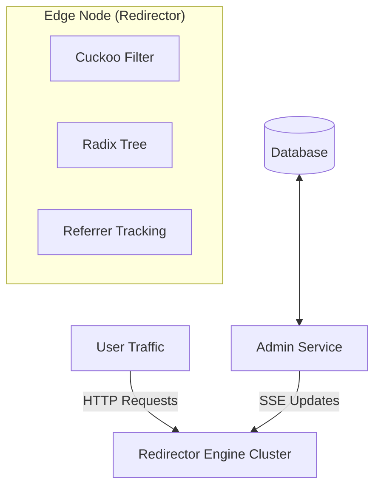

# Universal Redirector System Architecture

## 1. System Overview

The system is designed as a distributed, high-performance redirection platform consisting of two distinct components:

1.  **Admin Service (Central Core):** A single, centralized service responsible for data persistence, management APIs, and broadcasting state changes. It acts as the "Source of Truth."
2.  **Redirector Engine (Edge Nodes):** Multiple distributed instances (Edge Workers) responsible for handling high-volume traffic, redirecting users, and tracking analytics. These nodes are "semi-stateless," maintaining an in-memory synchronized state of active rules.

### Architecture Diagram



---

## 2. The Redirector Engine (Edge)

The Redirector Engine is optimized for **low latency** and **high throughput**. It minimizes database lookups by maintaining local state synchronized via Server-Sent Events (SSE).

### 2.1 Core Data Structures

#### A. The Gatekeeper: Cuckoo Filter
We use a **Cuckoo Filter** as a mutable "Allow List" to instantly reject 404 traffic without hitting the router or database.
*   **Why:** Supports efficient deletions (unlike Bloom filters) and high density.
*   **Capacity:** 100k+ URLs fit in ~150KB.

#### B. The Routing Cache: Segmented Radix Tree
While the Cuckoo Filter answers "Does it exist?", the **Radix Tree** answers "Where does it go?".
*   **Optimization:** Nodes effectively hold the full routing table for their active language slices or hot paths.

### 2.2 Referrer Handling (Hybrid Priority Strategy)

To accurately attribute traffic sources for analytics, the engine implements a **Hybrid Priority Strategy**. This strictly prioritizes explicit user intent (tags) over implicit browser headers.

**Priority Order:**
1.  **Explicit Tracking:** Query Parameters (e.g., `utm_source`, `ref`) - **Highest Trust**.
2.  **Implicit Tracking:** `Referer` HTTP Header - **Fallback**.

#### Implementation Logic
```typescript
/**
 * Hybrid Priority Strategy
 */
function resolveReferrer(req: Request, url: URL) {
  // 1. Check Query Params (Explicit)
  const explicitTags = ['ref', 'source', 'utm_source'];
  for (const tag of explicitTags) {
    const val = url.searchParams.get(tag);
    if (val) return { type: 'explicit', val: val };
  }

  // 2. Check Header (Implicit)
  const implicit = req.headers.get('Referer');
  if (implicit) return { type: 'implicit', val: implicit };

  return { type: 'none', val: null };
}
```

### 2.3 Edge Code Structure (HonoJS Example)

The following example combines the Cuckoo Filter gatekeeping with the detailed Referrer Tracking logic.

```typescript
import { Hono } from 'hono';
import { CuckooFilter } from 'bloom-filters';
import { createRouter } from 'radix3';

const app = new Hono();

// Mutable State
const gatekeeper = new CuckooFilter(150000);
const router = createRouter();

app.get('*', async (c) => {
  const url = new URL(c.req.url);
  const path = url.pathname;
  const host = url.hostname;
  const key = host + path;

  // 1. Fast 404 Check (Gatekeeper)
  if (!gatekeeper.has(key)) {
    return c.notFound();
  }

  // 2. Routing Lookup
  let route = router.lookup(path);

  // 3. Cache Miss / Lazy Load Handling
  if (!route) {
    // In a real scenario, fetch from Admin API or DB replica
    // For this architecture, we assume eventual consistency via SSE
    return c.notFound();
  }

  // 4. Referrer & Analytics
  const ref = resolveReferrer(c.req.raw, url);

  // Async Analytics Logging (Non-blocking)
  c.executionCtx.waitUntil(
    logAnalytics({
      path,
      referrer: ref.val,
      type: ref.type,
      ua: c.req.header('User-Agent')
    })
  );

  return c.redirect(route.destination, 301);
});

async function logAnalytics(data) {
  // Dispatch to Analytics Queue/DB
  console.log('[ANALYTICS]', JSON.stringify(data));
}
```

---

## 3. The Admin Service (Central)

The Admin Service is the control plane. It exposes APIs for creating, updating, and deleting URL rules. It is designed to be **Database Agnostic**, capable of running on top of PostgreSQL, PocketBase, or other stores.

### 3.1 Responsibilities
1.  **Management API:** REST/RPC endpoints for the Dashboard.
2.  **Persistence:** Stores the canonical state of all redirects.
3.  **Synchronization Hub:** Broadcasts changes to all connected Redirector Engines.

### 3.2 Database Agnosticism
The service implements a repository pattern to support multiple backends:
*   **PostgreSQL:** Uses `NOTIFY/LISTEN` to trigger internal events.
*   **PocketBase:** Uses native hooks to trigger internal events.

### 3.3 Synchronization Protocol (SSE)

The Engines connect to the Admin Service via **Server-Sent Events (SSE)**.

**Endpoint:** `GET /sync/stream`

**Payload Format:**
```json
{
  "id": "evt_12345",
  "event": "update",
  "data": {
    "action": "create",  // "create" | "update" | "delete"
    "rule": {
      "path": "/promo",
      "destination": "https://myshop.com/promo-v2",
      "host": "myshop.com"
    }
  }
}
```

**Engine Behavior on Update:**
1.  **Create:** Add hash to Cuckoo Filter; Add route to Radix Tree.
2.  **Delete:** Remove hash from Cuckoo Filter; Remove route from Radix Tree.
3.  **Update:** Update Radix Tree entry.

---

## 4. Deployment Matrix

| Component | Cloudflare Workers | AWS Lambda@Edge | VPS / Docker |
| :--- | :--- | :--- | :--- |
| **Redirector Engine** | **Supported** (High Performance) | **Supported** | **Supported** |
| **Admin Service** | Not Recommended (Long running) | Not Recommended | **Recommended** |
| **Sync Method** | SSE Client | SSE Client | SSE Client |
