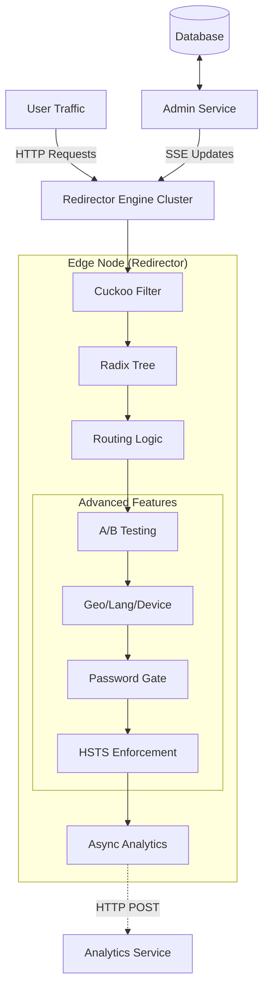

# Universal Redirector System Architecture

## 1. System Overview

The system is designed as a distributed, high-performance redirection platform consisting of two distinct components:

1.  **Admin Service (Central Core):** A single, centralized service responsible for data persistence, management APIs, and broadcasting state changes. It acts as the "Source of Truth."
2.  **Redirector Engine (Edge Nodes):** Multiple distributed instances (Edge Workers) responsible for handling high-volume traffic, redirecting users, and tracking analytics. These nodes are "semi-stateless," maintaining an in-memory synchronized state of active rules.

### Architecture Diagram



---

## 2. The Redirector Engine (Edge)

The Redirector Engine is optimized for **low latency** and **high throughput**. It minimizes database lookups by maintaining local state synchronized via Server-Sent Events (SSE).

### 2.1 Core Data Structures

#### A. The Gatekeeper: Cuckoo Filter
We use a **Cuckoo Filter** as a mutable "Allow List" to instantly reject 404 traffic without hitting the router or database.
*   **Why:** Supports efficient deletions (unlike Bloom filters) and high density.
*   **Capacity:** 100k+ URLs fit in ~150KB.

#### B. The Routing Cache: Segmented Radix Tree
While the Cuckoo Filter answers "Does it exist?", the **Radix Tree** answers "Where does it go?".
*   **Optimization:** Nodes effectively hold the full routing table for their active language slices or hot paths.

### 2.2 Referrer Handling (Hybrid Priority Strategy)

To accurately attribute traffic sources for analytics, the engine implements a **Hybrid Priority Strategy**. This strictly prioritizes explicit user intent (tags) over implicit browser headers.

**Priority Order:**
1.  **Explicit Tracking:** Query Parameters (e.g., `utm_source`, `ref`) - **Highest Trust**.
2.  **Implicit Tracking:** `Referer` HTTP Header - **Fallback**.

#### Implementation Logic
```typescript
/**
 * Hybrid Priority Strategy
 */
function resolveReferrer(req: Request, url: URL) {
  // 1. Check Query Params (Explicit)
  const explicitTags = ['ref', 'source', 'utm_source'];
  for (const tag of explicitTags) {
    const val = url.searchParams.get(tag);
    if (val) return { type: 'explicit', val: val };
  }

  // 2. Check Header (Implicit)
  const implicit = req.headers.get('Referer');
  if (implicit) return { type: 'implicit', val: implicit };

  return { type: 'none', val: null };
}
```

### 2.3 Edge Code Structure (HonoJS Example)

The following example combines the Cuckoo Filter gatekeeping with the detailed Referrer Tracking logic, along with dynamic status codes and HSTS enforcement.

```typescript
import { Hono } from 'hono';
import { CuckooFilter } from 'bloom-filters';
import { createRouter } from 'radix3';

const app = new Hono();

// Mutable State
const gatekeeper = new CuckooFilter(150000);
const router = createRouter();

// Config State (Synced from Admin)
const domainConfig = {
  hsts_enabled: true
};

app.get('*', async (c) => {
  const url = new URL(c.req.url);
  const path = url.pathname;
  const host = url.hostname;
  const key = host + path;

  // 1. Fast 404 Check (Gatekeeper)
  if (!gatekeeper.has(key)) {
    return c.notFound();
  }

  // 2. Routing Lookup
  let route = router.lookup(path);

  // 3. Cache Miss / Lazy Load Handling
  if (!route) {
    // In a real scenario, fetch from Admin API or DB replica
    // For this architecture, we assume eventual consistency via SSE
    return c.notFound();
  }

  // 4. HSTS Enforcement
  if (domainConfig.hsts_enabled) {
    c.header('Strict-Transport-Security', 'max-age=31536000; includeSubDomains; preload');
  }

  // 5. Referrer & Analytics
  const ref = resolveReferrer(c.req.raw, url);

  // Async Analytics Logging (Non-blocking)
  c.executionCtx.waitUntil(
    logAnalytics({
      path,
      referrer: ref.val,
      type: ref.type,
      ua: c.req.header('User-Agent'),
      ip: c.req.header('CF-Connecting-IP') // Example IP header
    })
  );

  // 6. Redirect (Dynamic Status Code)
  // Default to 301 if not specified
  const status = route.status_code || 301;
  return c.redirect(route.destination, status);
});

async function logAnalytics(data) {
  // Handle IP Anonymization if enabled
  if (data.ip && config.anonymize_ip) {
      data.ip = await hashIP(data.ip);
  }
  // Dispatch to Analytics Queue/DB
  console.log('[ANALYTICS]', JSON.stringify(data));
}
```

---

## 3. Advanced Traffic Routing Architecture

The system extends basic redirection with advanced conditional routing logic, executed entirely at the edge to ensure minimal latency.

### 3.1 A/B Testing (Split Testing)
To support marketing optimization, the system implements **Probabilistic Split Testing**.
*   **Logic:** A single short URL maps to multiple destination variants, each with an assigned weight.
*   **Execution:** Instead of maintaining per-user state (which is expensive and complex at the edge), we use a random number generator (0-100) to select the destination based on the configured probability distribution.
*   **Analytics:** The selected variant ID is logged in the asynchronous analytics payload.

### 3.2 Language Targeting
*   **Detection:** The system parses the `Accept-Language` HTTP header from the incoming request.
*   **Routing:** It checks if a specific destination rule exists for the primary detected language.
*   **Fallback:** If no match is found, or the header is missing, the system strictly defaults to the configured **Fallback URL** to ensure no user hits a dead end.

### 3.3 Geo Targeting
*   **Strategy:** To avoid the latency of external IP-to-Geo lookups, the system relies exclusively on **Edge Platform Headers** (e.g., `cf-ipcountry` on Cloudflare) for location data.
*   **Granularity:** Routing decisions are primarily based on Country codes (ISO 3166-1 alpha-2).
*   **Flow:** The edge worker reads the header -> looks up country-specific destination -> redirects or falls back.

### 3.4 Device & Deep Linking
*   **Device Targeting:** The system analyzes the `User-Agent` header to categorize the device as **iOS**, **Android**, or **Desktop**, routing the user to app store links or web versions accordingly.
*   **Deep Linking:** The system supports custom schemes (e.g., `myapp://`) as valid destinations. For app-specific routing, logic can be chained: *Check Device (iOS) -> Redirect to `myapp://`*.

---

## 4. Extended Link Features Implementation

### 4.1 Password Protection
For sensitive links, the system implements an authentication gate directly at the edge.
*   **Flow:**
    1.  **Request:** User clicks the link.
    2.  **Check:** Edge detects the `password_protected` flag on the route.
    3.  **Intercept:** Instead of a 301 Redirect, the Edge serves a lightweight **HTML page** with a password form.
    4.  **Submission:** The form POSTs back to the same URL.
    5.  **Validation:** The Edge verifies the password against the stored hash.
    6.  **Redirect:** On success, the user is redirected to the final destination; otherwise, the form is re-rendered with an error.

### 4.2 Link Expiration
Link expiration is handled with a focus on performance and eventual consistency.
*   **Time-Based (TTL):** The route contains an `expires_at` timestamp. The Edge checks this on every request. If `current_time > expires_at`, it immediately returns 404 or an Expiration Page.
*   **Click-Based (Count):**
    *   **Challenge:** Precise global counting is difficult in distributed edge systems without locking.
    *   **Solution:** We accept **Eventual Consistency**. Click counts are aggregated asynchronously. Once the limit is reached, the Admin Service pushes a `DELETE` or `UPDATE` event via SSE to remove the route from all edges. This may allow a small margin of "overshoot" clicks but preserves edge speed.

### 4.3 Redirection Types
The system allows configuring the HTTP status code per link to support various SEO and caching strategies.
*   **301 Moved Permanently:** The default for new links. Browsers cache this response aggressively.
*   **302 Found (Temporary):** Used for links that change frequently or for temporary campaigns.
*   **Implementation:** The status code is stored as part of the route configuration (`route.status_code`) and applied dynamically at the moment of redirection.

### 4.4 HSTS Enforcement
To ensure secure communication, the Redirector Engine enforces **HTTP Strict Transport Security (HSTS)** at the domain level.
*   **Configuration:** The Admin Service provides a domain-wide setting (default: enabled).
*   **Execution:** If enabled for the requested domain, the Engine injects the `Strict-Transport-Security` header into every response (redirects, 404s, password pages).
*   **Header Value:** `max-age=31536000; includeSubDomains; preload` (1 Year).

---

## 5. The Admin Service (Central)

The Admin Service is the control plane. It exposes APIs for creating, updating, and deleting URL rules. It is designed to be **Database Agnostic**, capable of running on top of PostgreSQL, PocketBase, or other stores.

### 5.1 Responsibilities
1.  **Management API:** REST/RPC endpoints for the Dashboard.
2.  **Persistence:** Stores the canonical state of all redirects.
3.  **Synchronization Hub:** Broadcasts changes to all connected Redirector Engines.

### 5.2 Database Agnosticism
The service implements a repository pattern to support multiple backends:
*   **PostgreSQL:** Uses `NOTIFY/LISTEN` to trigger internal events.
*   **PocketBase:** Uses native hooks to trigger internal events.

### 5.3 Synchronization Protocol (SSE)

The Engines connect to the Admin Service via **Server-Sent Events (SSE)**.

**Endpoint:** `GET /sync/stream`

**Payload Format:**
```json
{
  "id": "evt_12345",
  "event": "update",
  "data": {
    "action": "create",  // "create" | "update" | "delete"
    "rule": {
      "path": "/promo",
      "destination": "https://myshop.com/promo-v2",
      "host": "myshop.com",
      "status_code": 302, // Optional, defaults to 301
      "meta": {
          "password_protected": false
      }
    },
    "domain_config": { // Optional sync of domain-level settings
        "host": "myshop.com",
        "hsts_enabled": true
    }
  }
}
```

**Engine Behavior on Update:**
1.  **Create:** Add hash to Cuckoo Filter; Add route to Radix Tree.
2.  **Delete:** Remove hash from Cuckoo Filter; Remove route from Radix Tree.
3.  **Update:** Update Radix Tree entry.

---

## 6. Analytics Integration

The Redirector Engine is completely decoupled from the data processing and visualization layers. Its sole responsibility regarding analytics is to reliably collect and transmit raw engagement data to the **Analytics Service**.

### 6.1 Data Transmission Protocol
*   **Method:** **Non-blocking HTTP POST** (Fire-and-Forget).
*   **Timing:** Requests are dispatched asynchronously (`ctx.waitUntil` or background threads) to ensure the user redirection is never delayed by analytics logging.
*   **Endpoint:** `POST /v1/collect` (Hosted by the Analytics Service).

### 6.2 Data Schema (Payload)
The engine aggregates all relevant request context into a flat JSON structure.

```json
{
  "timestamp": "2023-10-27T10:00:00Z",
  "event_type": "redirect",
  "short_code": "/promo-summer",
  "destination_url": "https://myshop.com/summer-sale?utm_source=twitter",
  "visitor": {
    "ip": "e3b0c44298fc1c149afbf4c8996fb92427ae41e4649b934ca495991b7852b855", // Hashed if anonymization enabled
    "user_agent": "Mozilla/5.0 (iPhone; CPU iPhone OS 16_6...)",
    "geo": {
      "country": "US",
      "region": "CA",
      "city": "San Francisco"
    }
  },
  "referrer": {
    "url": "https://t.co/xyz",
    "source_type": "social", // Derived from Hybrid Priority Strategy
    "explicit_tag": "twitter" // If found in query params
  },
  "utm_tags": {
    "source": "twitter",
    "medium": "social",
    "campaign": "summer_sale"
  },
  "meta": {
    "variant_id": "variant_b", // For A/B testing
    "device_type": "mobile"    // Parsed at edge
  }
}
```

### 6.3 Separation of Concerns
*   **Redirector Engine:** Responsible for **Extraction** (parsing headers, UTMs) and **Transmission**.
*   **Analytics Service:** Responsible for **Ingestion**, **Processing** (anonymization, sessionizing), **Storage** (Time-series DB), and **Visualization** (Dashboards).

### 6.4 Privacy & Anonymization
To comply with GDPR, CCPA, and other privacy regulations, the system supports configurable IP anonymization.
*   **Configuration:** Controlled via a system-wide or per-domain setting synced from the Admin Service.
*   **Execution:** The Redirector Engine processes the IP address **before** transmission to the Analytics Service.
*   **Mechanism:** Default behavior is **Hashing** (e.g., SHA-256) to ensure the raw IP is never persisted or transmitted over the wire to the analytics backend.

---

## 7. Deployment Matrix

| Component | Cloudflare Workers | AWS Lambda@Edge | VPS / Docker |
| :--- | :--- | :--- | :--- |
| **Redirector Engine** | **Supported** (High Performance) | **Supported** | **Supported** |
| **Admin Service** | Not Recommended (Long running) | Not Recommended | **Recommended** |
| **Sync Method** | SSE Client | SSE Client | SSE Client |
